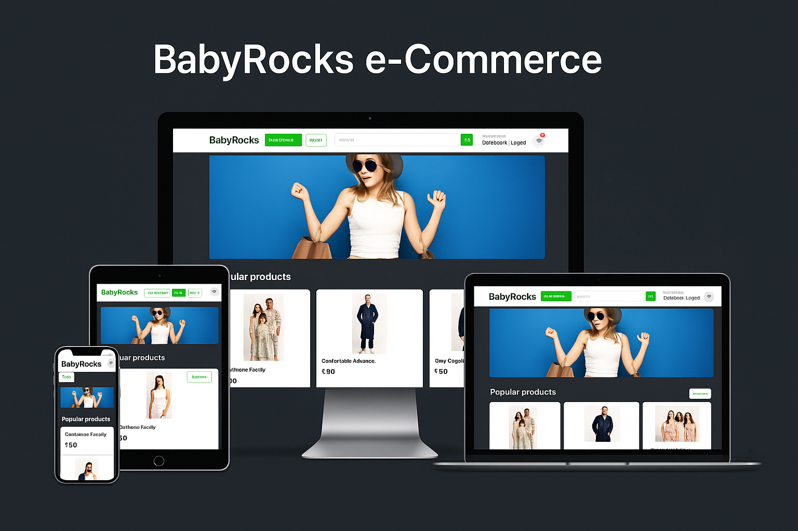
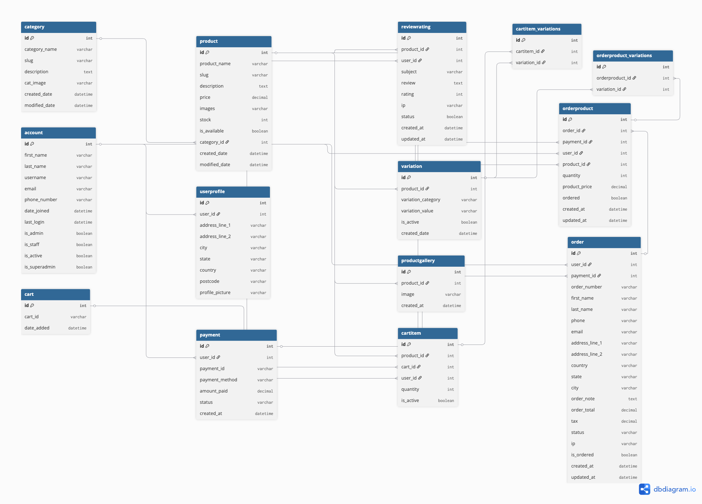
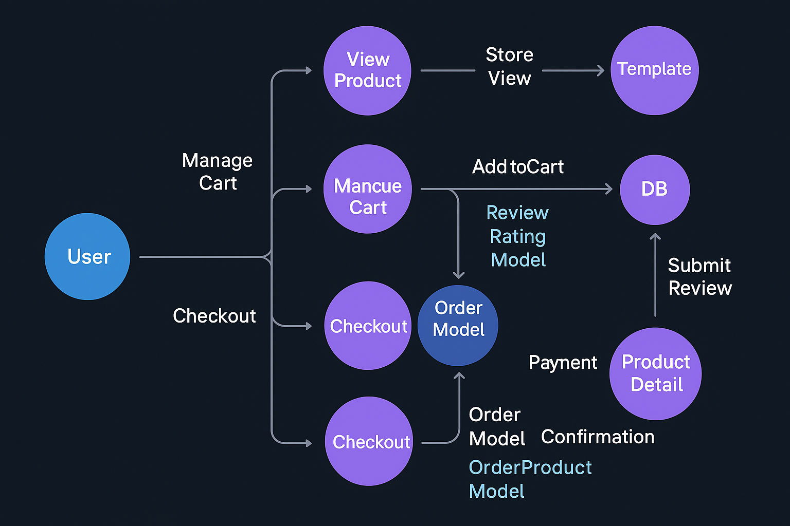
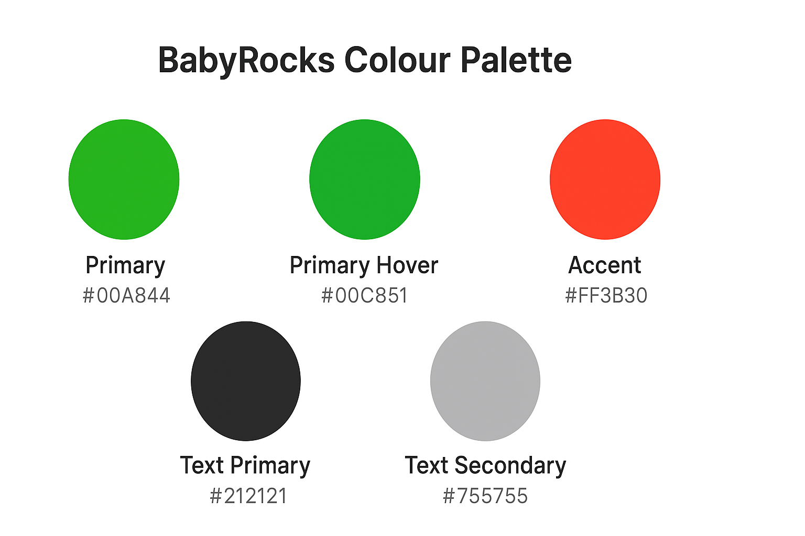
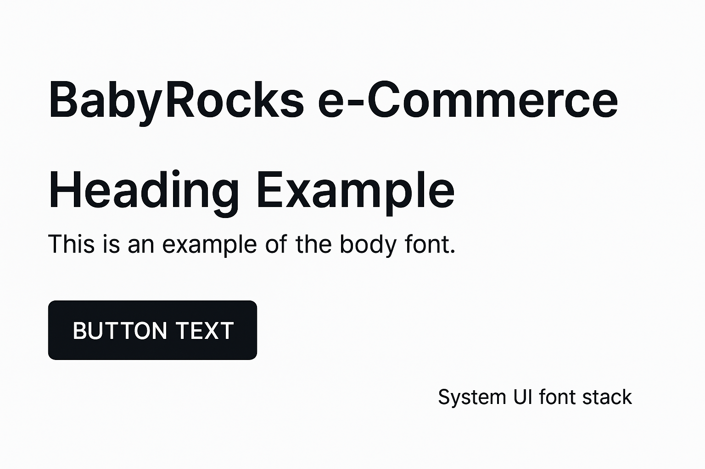
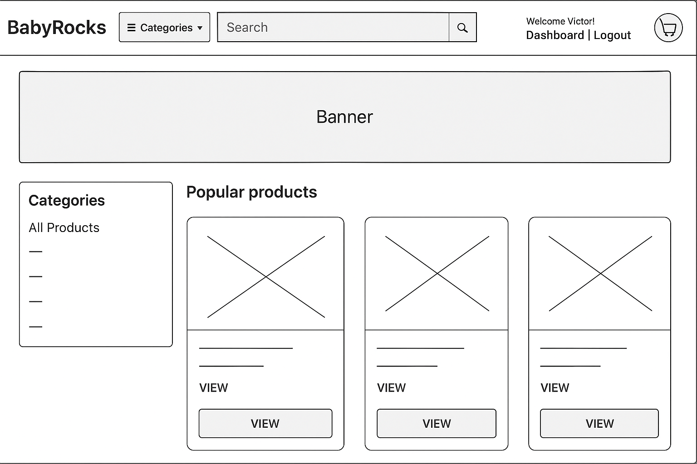
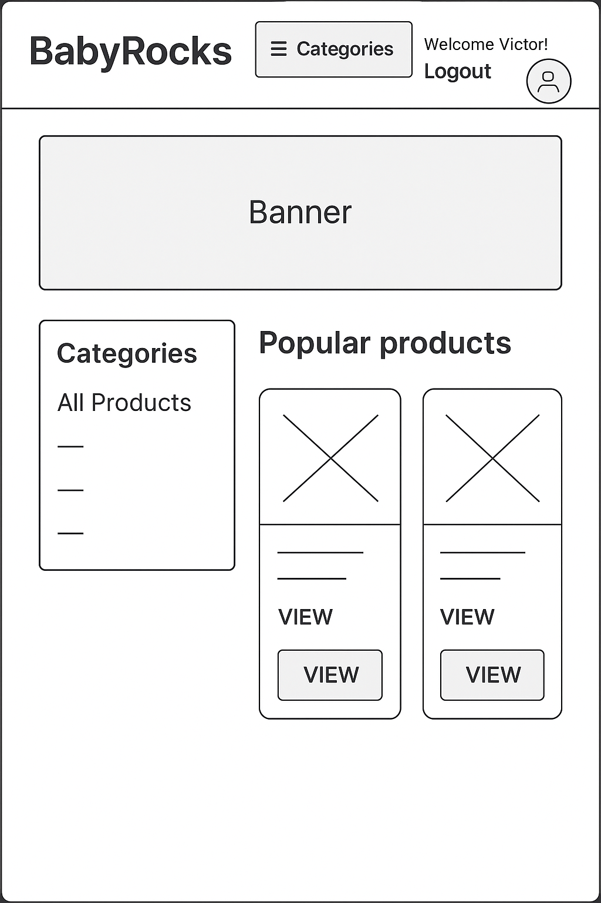
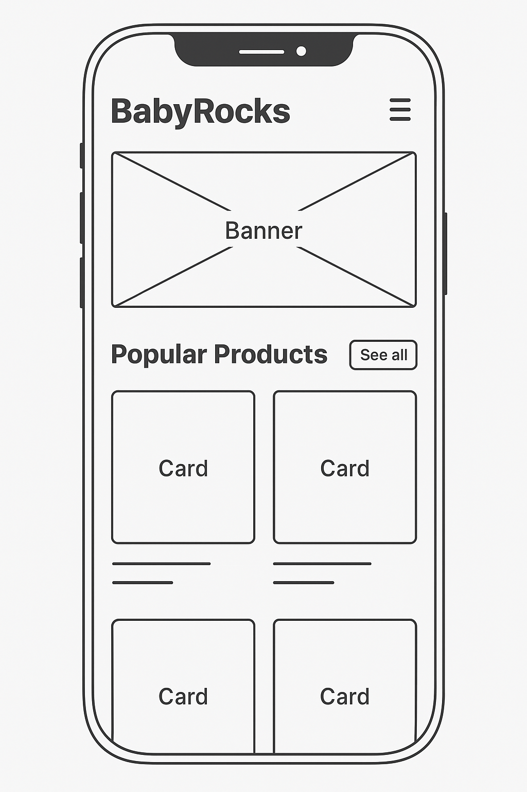

# 🛍️ BabyRocks — e-Commerce Platform  


A responsive, full-stack e-commerce application built with **Django**, featuring product browsing, categories, variations, reviews, user accounts, cart management, ordering, and an admin dashboard.  
Designed to demonstrate clean architecture, scalability, and professional documentation.

Live site: https://babyrocks.vicstack.uk/
GitHub repository: https://github.com/bukaro8/babyrocks

---

## Deployment

Live deployed URL: https://babyrocks.vicstack.uk/

This project is deployed using Coolify.

Required production environment variables:

```text
SECRET_KEY
DEBUG=False
ALLOWED_HOSTS
DATABASE_URL
EMAIL_HOST
EMAIL_PORT
EMAIL_HOST_USER
EMAIL_HOST_PASSWORD
EMAIL_USE_TLS
DEFAULT_FROM_EMAIL
PAYPAL_CLIENT_ID
PAYPAL_SECRET
```

Deployment steps:

1. Push latest code to GitHub
2. Connect repo to Coolify
3. Configure environment variables
4. Configure production database using DATABASE_URL
5. Run migrations
6. Collect static files
7. Verify live URL loads
8. Retest ecommerce journey

---

## 💻 Deployment (Run Locally)

```bash
# Clone repository
git clone https://github.com/bukaro8/babyrocks.git
cd babyrocks

# Create virtual environment
python3 -m venv .venv
source .venv/bin/activate   # macOS/Linux
# or
.venv\Scripts\activate      # Windows

# Install dependencies
pip install -r requirements.txt

# Create .env file (example)
cp .env.example .env

# Run migrations
python manage.py migrate

# Create superuser (admin)
python manage.py createsuperuser

# Start development server
python manage.py runserver
````

---

## 🛠 Tech Stack

| Technology  | Purpose                    | Version  |
| ----------- | -------------------------- | -------- |
| Django      | Backend framework          | 6.x      |
| Python      | Core application           | 3.12+    |
| PostgreSQL  | Production database        | 14+      |
| SQLite      | Local development database | Built-in |
| Bootstrap 5 | Front-end styling          | —        |
| FontAwesome | Icons                      | —        |
| Coolify     | Deployment platform        | —        |

---

## 👥 User Stories

This project follows Agile user-centred design.

Only a short summary appears in the main README.

For the full detailed set of user stories (first-time user, returning user, guest checkout, admin tasks, acceptance criteria):

👉 **See full User Stories:**
[`./docs/user-stories.md`](./docs/user-stories.md)

---

## ✨ Features

| Feature               | Description                                     |
| --------------------- | ----------------------------------------------- |
| **User Accounts**     | Register, login, logout, dashboard              |
| **Product Catalogue** | Browse all products, view details, categories   |
| **Variations**        | Colours & sizes using Django Variation Model    |
| **Search System**     | Search products by name/description             |
| **Cart Management**   | Add/remove/edit items, supports anonymous carts |
| **Checkout Flow**     | Capture address, order summary & total          |
| **Order Processing**  | Orders saved with status tracking               |
| **Reviews & Ratings** | Users can review only purchased products        |
| **Admin Dashboard**   | Manage products, orders, categories             |
| **Responsive Design** | Works across desktop, tablet, and mobile        |

---

## 🗂 Database Structure

A complete Entity Relationship Diagram (ERD) of the BabyRocks system:



### **Description**

* Products belong to categories
* Products have variations (size, colour)
* A product may have multiple gallery images
* Users may add products to a cart (with variations)
* Orders store cart items at checkout
* Users can review products they have purchased

---

## 🔄 Data Flow

The high-level data flow through the application:



### **Description**

1. **User** interacts with the interface (product, cart, checkout).
2. **Request** is sent to Django’s URL router.
3. **View** processes business logic and interacts with models.
4. **Models** query or update the **database**.
5. **Templates** render the final output.
6. **Response** is returned to the user browser.

This architecture follows Django’s MTV pattern.

---

## 🎨 Design System

### **Colour Palette**



| Role            | Hex       | Usage                    |
| --------------- | --------- | ------------------------ |
| Primary Green   | `#00A844` | Buttons, navbar actions  |
| Hover Green     | `#00C851` | Button hover state       |
| Accent Red      | `#FF3B30` | Cart notification badge  |
| Text Dark       | `#212121` | Headings, product titles |
| Text Medium     | `#757575` | Secondary text           |
| Border Grey     | `#E5E5E5` | Cards, separators        |
| Background Grey | `#F5F5F5` | Page background          |

---

## ✒ Typography



| Element   | Font Stack                                                                   | Size    | Weight |
| --------- | ---------------------------------------------------------------------------- | ------- | ------ |
| Headings  | `system-ui, -apple-system, "Segoe UI", Roboto, Helvetica, Arial, sans-serif` | ~2rem   | 600    |
| Body Text | Same as above                                                                | 1rem    | 400    |
| Buttons   | Same as above                                                                | 0.95rem | 600    |

---

## 📐 Wireframes

### **Desktop**



### **Tablet**



### **Mobile**



---

## 📦 Folder Structure

```text
babyrocks/
│
├── accounts/
├── category/
├── carts/
├── orders/
├── store/
│
├── static/
├── templates/
│
├── docs/
│   ├── images/
│   │   ├── banner.png
│   │   ├── db-diagram.png
│   │   ├── data-flow.png
│   │   └── color-palette.png
│   ├── typography/
│   │   └── typography.png
│   └── wireframes/
│       ├── desktop.png
│       ├── tablet.png
│       └── mobile.png
│
└── README.md
```

---

## Testing

| Feature tested | Steps taken | Expected result | Actual result | Status | Date tested |
| -------------- | ----------- | --------------- | ------------- | ------ | ----------- |
| Homepage | Opened the live site homepage in a browser. | Homepage loads with branding, navigation, product content and no visible errors. | Homepage loaded successfully and displayed the expected layout and navigation. | Pass | 27/05/2026 |
| Product browsing | Opened the store page and viewed the product listing. | Products are displayed with images, names, prices and links to product details. | Product listing displayed correctly with available products. | Pass | 27/05/2026 |
| Product detail | Opened a product detail page from the store listing. | Product image, price, description, variations, reviews and add-to-cart control are visible. | Product detail page displayed the expected product information and controls. | Pass | 27/05/2026 |
| Cart add | Selected product options and added the item to the cart. | Product is added to the cart with the selected variation and correct quantity. | Product appeared in the cart with the selected options and correct quantity. | Pass | 27/05/2026 |
| Cart update | Increased and decreased item quantity in the cart. | Cart quantity and totals update correctly. | Cart quantity and totals updated as expected. | Pass | 27/05/2026 |
| Cart remove | Removed an item from the cart. | Item is removed and cart totals update correctly. | Item was removed and the cart reflected the updated total. | Pass | 27/05/2026 |
| Checkout form | Completed the checkout billing form and submitted it. | Required fields validate and the payment review page loads. | Checkout form accepted valid details and loaded the payment review page. | Pass | 27/05/2026 |
| PayPal success | Completed a PayPal payment using the checkout flow. | Payment is captured, order is recorded and confirmation page is shown. | Sandbox PayPal payment completed successfully and order confirmation page displayed. | Pass | 27/05/2026 |
| PayPal cancel/error | Cancelled or interrupted the PayPal payment flow. | User remains in the checkout/payment flow without a completed order. | Payment cancellation showed the message: 'Payment was cancelled. No money has been taken.' and no order was completed. | Pass | 27/05/2026 |
| Registration | Created a new user account using the registration form. | Account registration completes and the user receives the expected feedback. | Registration completed and the expected user feedback was shown. | Pass | 27/05/2026 |
| Login/logout | Logged in with valid credentials and then logged out. | User can access the dashboard after login and is signed out after logout. | Login and logout worked as expected. | Pass | 27/05/2026 |
| Profile edit | Updated profile details from the account dashboard. | Saved profile changes persist and success feedback is shown. | Profile changes saved successfully and confirmation feedback appeared. | Pass | 27/05/2026 |
| Order history | Opened the order history page from the dashboard. | Previous completed orders are listed with order details available. | Order history displayed completed orders and detail links correctly. | Pass | 27/05/2026 |
| Review | Submitted a product review while logged in. | Review is saved and appears on the product detail page. | Review submission worked correctly after removing unnecessary demo warning. | Pass | 27/05/2026 |
| Mobile responsive check | Checked key pages on a mobile viewport. | Layout remains usable with readable text, accessible navigation and no content overflow. | Main pages remained usable and responsive on mobile. | Pass | 27/05/2026 |

---


## 🙏 Credits

* **Django Documentation** — [https://docs.djangoproject.com](https://docs.djangoproject.com)
* **Bootstrap 5** — CSS framework for layout & components
* **FontAwesome** — Icons
* **Coolify** — Deployment platform for self-hosting
* Product images sourced from stock photography for demo purposes
* Wireframes & diagrams generated using AI-assisted tools

---

**© 2025 BabyRocks — Created by Victor Ramirez**

```
